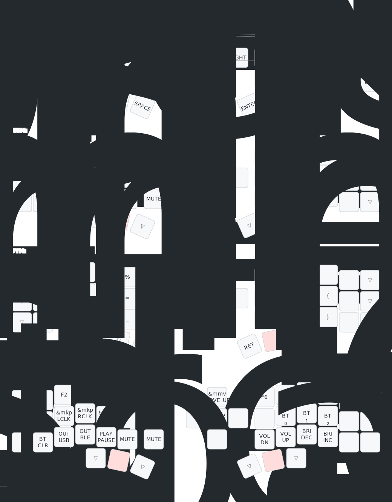

# Mouse Corne configuration

## Usage

There is only a need to modify the code under config

Use [keymap-editor](https://nickcoutsos.github.io/keymap-editor/) for easy modification

## Keymap Diagram

